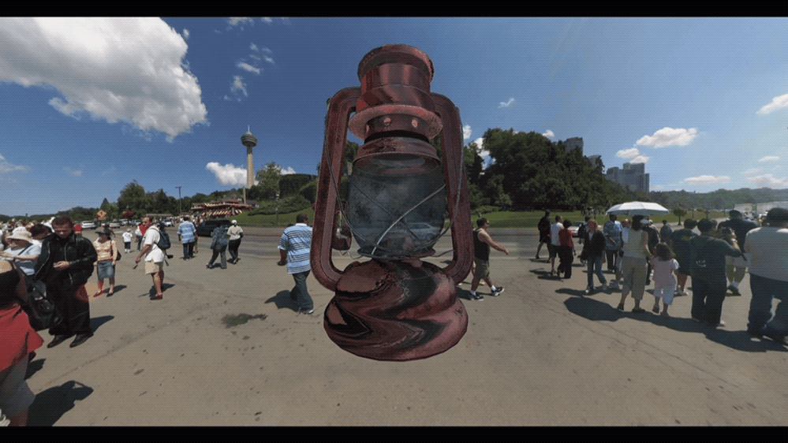

# Physical Based Rendering

We have implemented physical based rendering in OpenGL using Cook-Torrance BRDF and are using image based lightning for ambient lights.

## Build Instructions
The application was developed using Visual Studio 2017, open the 'lantern_viewer.sln' in the 'lantern_viewer' folder and it should compile without any issues.

Please note, the libraries are only installed for x64, if you change the build target to x86 it will break.
